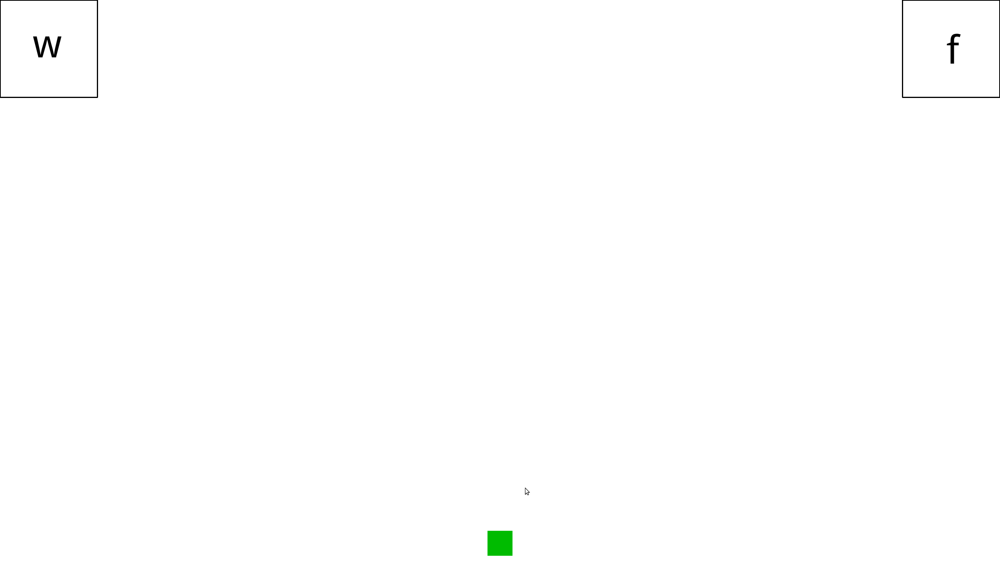

```{r setup, include=FALSE}
knitr::opts_chunk$set(echo = TRUE)
```

## Introduction
In this study we conceptually replicate the following study: 

>Tomlinson Jr, J. M., Bailey, T. M., & Bott, L. (2013). Possibly all of that and then some: Scalar implicatures are understood in two steps. *Journal of memory and language*, 69(1), 18-35.

The original research question surrounded the linguistic phenomenon of scalar implicatures like "some scientists preregister their studies". The word 'some' is semantically compatible with 'all', but is commonly pragmatically used to indicate that it refers to only some but not to all scientist.

The authors tested how these implicatures are processed and compared a two-step processing account to a one-step processing account. In the two-step account, listeners access a basic meaning and then enrich the basic meaning to form the scalar implicature. In a one-step account, listeners directly incorporated scalar implicature into the sentence representation in parallel. 

To pit these two accounts against each other, they asked British English listeners to read sentences and to use a computer mouse to indicate whether each sentence was true or false. In three experiments, the authors present data that suggest that, when verifying sentences like "some scientists preregister their studies", average mouse paths initially move towards the true target and then change direction mid-flight to select the false target. This effect is modulated by the feedback that listeners receive in a critical training phase. One group of listeners were trained to interpret the critical sentences as possibly referring to all scientists, another group was trained to interpret these sentences as referring only to a subset of scientists, but not all. 

The present study conceptually replicates Experiment 1 of the original study with German listeners. We are only looking at the critical condition and we are only measuring the curvature of the trajectories as operationalized by the area-under-the-curve measure (see below for details). Using clustering algorithms, we test whether these curvature effects are simple artifacts of averaging over two categorically discrete movement trajectories.

## Participants
We will test 32 native speakers of German. All participants will be students at the University of Osnabrück and will receive course credit for participation. Applicants will be required to have normal or corrected-to-normal vision, and will have to be native speakers of German. They will be asked to report basic information on their handedness.

## Sample size justification
Based on a pilot data set of 12 subjects, we estimated the effect magnitude and relevant variance components for the analysis of the area under the curve. To be conservative, we simulated fake data assuming the following parameter values: The simulation was based on 50% of the effect magnitude observed in the pilot, and based on the estimated variance components of the pilot data (random intercept for both subject and sentence and residual variance) (see <https://osf.io/sbrcx/>). Even with these conservative effect magnitude estimates, a power analysis suggests that we achieve a power of 0.9 with 32 participants. Thus, 32 is our target sample size.

## Procedure
The experiment will be created and run in the experiment builder software `OpenSesame` (version 3.2.8b1) (Mathôt et al. 2011), using the `mousetrap-os` plugin (version 2.0.0) (Kieslich & Henninger 2017) in order to record the streaming x,y-coordinates of the participants' hand movements. The experimental files can be retrieved here: <https://osf.io/mtwfz/>. The machines running the experiment will be configured with Intel Xeon CPUs (E3-1245 v% @ 3.5GHz x 8), 32GB RAM, and the Ubuntu 16.04 LTS operating system. Participants will be individually seated in a sound-insulated booth in front of a Dell UP2716D UltraSharp monitor displaying the experiment across a visible area of 59.8 cm x 33.6 cm, at a resolution of 2560 x 1440 pixels. They will use a Dell MS116p optical computer mouse (1000 dpi) to perform the experimental task. Mouse cursor acceleration will be switched off using the command `xinput`, in order to ensure a linear mapping between hand movements and cursor displacement. In order to prevent mouse trajectories from reaching the screen edges (where artifically flat contour portions would result), a linear deceleration (with a divisor of 4) will be applied to this mapping via `xinput`. This may also serve to better ensure capturing the participants' motor behavior whilst the task-induced cognitive processes of interest are ongoing (Fischer & Hartmann 2014).

Participants will be asked to sign a standardized consent form before the experiment. There will be no spoken instructions issued to the participants other than an assurance that they may at any point during the experiment leave the booth to either ask any questions they may have, or to terminate their participation altogether.

The main experimental display will consist of a start button (a green square measuring 64 x 64 pixels, located at the bottom center of the screen), and the two response boxes (250 x 250 px), which will be located flush in the top left and top right corners of the screen, respectively. These will be labelled "w" (German: "wahr", 'true') and "f" (German: "falsch", 'false'). The left-right placement of these labels will be consistent within-participant, but will be counterbalanced across participants.



In each trial, the participants will trigger the stimulus presentation by clicking on the start button, upon which a sentence will be orthographically displayed center-screen on a word-by-word basis at a rate of 300 ms per word. Recording of the mouse trajectory will start with the appearance of the final word of a sentence. In order to further encourage mouse movements that take place during the processing of the stimulus, participants will receive a warning (three red exclamation marks displayed in the center of the screen) if they fail to initiate their movement within 500 ms of the appearance of the final word. As a part of the on-screen written instructions, participants will be asked to read the stimulus sentences and evaluate their truth. They will be told to indicate their judgment by moving the mouse cursor onto the appropriately labelled response box and clicking it, whereupon the response boxes will disappear from the screen. During the training phase, this will be followed by 500 ms of the on-screen feedback as stated above, before the next trial begins. During the main phase, only the start button will be displayed on an otherwise empty screen for the 500 ms inter-trial interval.

## Materials
All stimulus sentences will adhere to the basic structure "Quantifier X sind (German: 'are') Y", with the quantifier being either "alle" (German: 'all') or "einige" (German: 'some'). Depending on the sentence type, X and Y will either represent a category or an exemplar, e.g. "Alle Schweine sind Zitronen" (German: 'All pigs are lemons'). Following Tomlinson et al. (2013), there will be six sentence types in total:

| Type                  	| Pattern                            	| Example                                               	|
|-----------------------	|------------------------------------	|-------------------------------------------------------	|
| Some critical         	| Some [exemplar] are [category]     	| Einige Tauben sind Vögel (Some pigeons are birds)     	|
| All true              	| All [exemplar] are [category]      	| Alle Tauben sind Vögel (All pigeons are birds)        	|
| All false             	| All [exemplar] are [non-category]  	| Alle Tauben sind Steine (All pigeons are stones)      	|
| Some true             	| Some [category] are [exemplar]     	| Einige Vögel sind Tauben (Some birds are pigeons)     	|
| Some false            	| Some [exemplar] are [non-category] 	| Einige Tauben sind Steine (Some pigeons are stones)   	|
| Some subordinate true 	| Some [exemplar] are [sub-category] 	| Einige Tauben sind weiblich (Some pigeons are female) 	|

The necessary stimulus quadruplets (exemplar, category, non-category, sub-category) will be created in part by translating the stimuli used by Tomlinson et al. (2013), whenever the German translation does not introduce idiosyncratic problems for the study at hand, and in part by an endeavor to determine German quadruplets that

- are generally comparable to the stimuli in Tomlinson et al. (2013) in terms of the types and range of entities and objects they refer to
- can reasonably be expected not to require expert knowledge on the participants' part in order for them to be able to swiftly issue truth value judgments with regards to these items

Given the taxonomic content of the desired stimulus sentences, one particular criterion for potential stimuli will concern composite nouns occurring in German quadruplet candidates / translations. For instance, in the sentence "Alle Tagebücher sind Bücher" ('All diaries are books'), the [exemplar] would already lexically expose the reader to the [category], with a potentially biasing influence. All stimuli can be retrieved here: <https://osf.io/mtwfz/>.

## Design
Before the main test portion of the experiment, participants will be presented with a training phase consisting of 100 trials, with a pseudo-randomized sequence of sentence types. The first six trials in this sequence will each represent one of the six sentence types (manually selected), while the remaining ninety-four trials will be randomized. In this phase, each participant will see the same sequencing of items. All 100 quadruplets used will be unique and will not reoccur in the main experimental phase. The sentence type 'Some critical' will appear twenty-five times, while the other sentence types will appear fifteen times each.

Participants will be randomly assigned to one of two groups (called "pragmatic condition" and "logical condition", respectively). These groups will differ only in terms of the on-screen feedback that will be issued immediately after each trial of the training phase (either "korrekt" or "inkorrekt"). Depending on group membership, subjects will receive feedback reinforcing either the pragmatic interpretation or the logical interpretation. The pragmatic interpretation corresponds to the some-but-not-all interpretation. Thus a sentence such as "some elephants are mammals" should be evaluated as false. The logical interpretation corresponds to the semantic interpretation. Thus, the sentence should be evaluated as true. No feedback will be issued during the main experimental phase.

In the main test phase, participants will go through a total of 180 trials (six sentence types * thirty quadruplets), with a randomized sequence for each participant.

## Processing
The raw data files generated by `OpenSesame` will be read in to `R` using the `readbulk` R package (Kieslich & Henninger 2016). All trials from the training phase will be excluded from further processing steps, as well as "incorrect", "early", and "slow" responses as detailed below in section "*Exclusion*". For all further preprocessing, the `mousetrap` R package will be used (Kieslich & Henninger 2017).

The raw mouse trajectories will be spatially remapped so that trajectories from all trials terminate on the left side (keeping the information on the chosen response box intact), and all trajectories share the same initial pair of x,y coordinates. In order to render movements differing in duration comparable, the appropriate (aggregating) analysis steps will use time-normalized trajectories (i.e. trajectories resampled to 101 steps separated by a within-trial constant time interval). All analysis steps regarding trajectory clustering (see below), however, will make use of "space-normalized" or spatialized trajectories, computed by resampling all raw trajectories to 20 spatially equidistant sample points each, thus placing "the focus on the overall shape of the trajectory rather than its details, which aids the detection of commonalities between trajectories and, thus, the identification of basic types" (Wulff et al. 2019).

For all preprocessing steps, see `00_preprocessing.R` at <https://osf.io/sm7v8/>.

## Data analysis

### Exclusion
Trials with "incorrect" responses (i.e. responses incongruent with the received training) will be discarded on a trial-by-trial basis. Trials that exhibited undesired early initiation patterns (violating the instructions) will be discarded. We operationalize such undesired early initiations by excluding trials in which the first sample of the trajectory was recorded outside of the starting area, which we define as a square area which shares its center with that of the start button, but is twice the button's size (see <https://osf.io/sm7v8/>). Additionally, trials exhibiting late movement initiation will be discarded, i.e. trials in which there has been no mouse movement within an initial period of 500 ms has expired (measured from the moment in which the final word of the trial's stimulus sentence appeared on-screen).

### Modelling AUC as a function of training
The code for the statistical models can be inspected here: <https://osf.io/tcwjg/>. We will calculate the area-under-the-curve (AUC) for each trajectory in the Some-critical condition using the mousetrap package (Kieslich & Henninger 2017) in R (R Core Team 2019). AUC is the geometric area between the actual trajectory and the direct path where areas below the direct path have been subtracted. Scaled AUC values will be submitted to a Bayesian multi-level regression model using `brms` (Bürkner 2017), predicting AUCs based on training (logical vs. pragmatic). We will add random intercepts for both participants and sentence. We will use a weakly informative normal distribution centered at 0 with SD = 2 for all population-level regression coefficients, truncated Student-t priors centered at 0 (df = 3) with SD = 1 for all standard deviations, and LKJ(2) priors for all correlation parameters. Four sampling chains with 4000 iterations each will be run, with a warm-up period of 2000 iterations. 

### Modelling cluster type as a function of training
Based on data from the pilot, we suspect that the above model is not appropriate for the data. In fact, Tomlinson et al.'s (2013) two-step model predicts two categorically different trajectory types, one that goes *straight* to the target and one that first moves toward the competitor and then changes directions to the competitor (henceforth "discrete change of mind", *dCoM*). This would result in (at least) two clusters of trajectories. We will estimate trajectory clusters using a *k*-means clustering algorithm on spatialized trajectories (see Wulff et al. 2019). We will first explore the estimated number of clusters using criteria based on cluster stability (Haslbeck & Wulff 2006), and the slope statistic (Fujita, Takahashi, & Patriota, 2014). In our pilot data, the *k*-estimation algorithms suggested two or three clusters of trajectory shapes. Crucially, both of these cluster patterns contained one *straight* and one *dCoM* trajectory type. Thus, for the present study, we will define these two "prototypes" in advance:

- *straight*: A trajectory that is a straight line between start point and target position.

- *dCoM*: A trajectory that first moves in a straight line to the competitor and then moves horizontally to the target position.

We will computationally map these prototypes onto the spatialized observed trajectories based on pointwise Euclidean distance. We will run a Bayesian logistic multilevel regression predicting trajectory type by training condition. The model will additionally account for random intercepts for both participants and target stimuli. We will use the same prior and model specification as above. All model specification can be retrieved in the `R` script `02_modeling.R` in the `Data and Analysis component`, see <https://osf.io/235ge/>). 

### Inferential assessment
For both models, we will identify a region of values around 0 that we consider practically equivalent to a null effect. For the AUC analysis, in the absence of guiding principles as to what constitutes a theoretically meaningful effect magnitude of mouse movement curvature, we will define the relative effect magnitude here in terms of 0.1 of the scaled AUC measure (i.e. the ROPE spans -0.05 to 0.05), i.e. one tenth of a standard deviation. For the cluster type analysis, we will consider values that are smaller than 0.2 in log odd space (i.e. the ROPE spans -0.1 to 0.1) as practically equivalent to zero. This interval covers a probability difference of 5% between training conditions. 

To assess evidence for the null hypothesis H0 (the difference in AUC between logical and pragmatic training is smaller than 0.05 standard deviations) over the alternative hypothesis Ha (the difference in AUC between logical and pragmatic training is larger than 0.05 standard deviations), we will calculate the Bayes factor by dividing the prior-odds of being within the ROPE (-0.05 - 0.05) by the posterior-odds of being within the ROPE. Evidence for the cluster analysis will be evaluated accordingly using the ROPE (-0.1 - 0.1). Values smaller than 1 indicate evidence for H0; values larger than 1 indicate evidence for Ha. Following Kass & Raftery (1995), we claim there to be substantial evidence for the alternative hypothesis if the Bayes factor is > 3.2, and strong evidence for the alternative hypothesis if the Bayes factor is > 10.

Additionally, we report the means and 95% credible intervals surrounding the means of the posterior distributions to quantify the model estimates and our uncertainty regarding these estimates. 


## Deviations from the original study
- As stated above, the present study will try to replicate only Experiment 1 of the original study.

- In the original study, "responses were considered outliers if mouse trajectories were three standard deviations outside of the mean AUC of all responses", and were discarded as such. The present replication will not adhere to this line of reasoning because such data trimming artificially decreases variance and reduces the number of observations. 

- The present study will use German stimuli to elicit responses from native speakers of German, as opposed to the use of British English in the original.

- Our experiment will be displayed on a larger screen than the original, with a differing aspect ratio (see the table below).

|                    	| Original 	| Replication    	|
|--------------------	|----------	|----------------	|
| Display resolution 	| ?        	| 2560 * 1440 px 	|
| Aspect ratio       	| 7:5      	| 16:9           	|
| Width              	| 35 cm    	| 59.8 cm        	|
| Height             	| 25 cm    	| 33.6cm         	|
| Diagonal           	| 17 in    	| 27 in          	|

- In Tomlinson et al. (2013), the location of the response boxes was slightly offset from the screen edges, whereas the current study will place them flush into the top corners of the display.

- The present replication effort will present participants with a rather small, square start button (64 x 64 px on a 27" screen), whereas the original study implemented an oblong, 2 cm x 5 cm button.

- The present analysis will only consider AUC as a dependent variable. We are primarily interested in trajectory curvature, thus we will not analyse temporal characteristics of responses. We will further refrain from analyzing the xneg measurement introduced by the original study. Xneg cannot be analyzed with conventional assumptions about the likelihood function. Xneg is not only bound to zero and one, it also exhibits a large amount of zero values (i.e. each trajectory that never moves horizontally away from its horizontal start position ). The original analysis inappropriately assumed a gaussian likelihood function for this measurement.

- As opposed to the frequentist approach in the original study, the present study will analyse the data using Bayesian multilevel regression models. Thus we will define different inferential criteria than the original study.


## References
Bürkner, P.-C. (2017). brms: An R package for Bayesian multilevel models using Stan. Journal of Statistical Software, 80(1), 1–28. https://doi.org/10/gddxwp

Fischer, M. H., & Hartmann, M. (2014). Pushing forward in embodied cognition: May we mouse the mathematical mind? Frontiers in Psychology, 5, 525. https://doi.org/10/gf4qzf

Fujita, A., Takahashi, D. Y., Patriota, A. G., & Sato, J. R. (2014). A non-parametric statistical test to compare clusters with applications in functional magnetic resonance imaging data. Statistics in Medicine, 33(28), 4949–4962. https://doi.org/10/ggjx2h

Haslbeck, J. M. B., & Wulff, D. U. (2016). Estimating the Number of Clusters via Normalized Cluster Instability. ArXiv:1608.07494 [Stat]. http://arxiv.org/abs/1608.07494

Kass, R. E., & Raftery, A. E. (1995). Bayes Factors. Journal of the American Statistical Association, 90(430), 773–795. https://doi.org/10/gdnbw3

Kieslich, P. J., & Henninger, F. (2016). Readbulk: An R package for reading and combining multiple data files. https://doi.org/10.5281/zenodo.596649

Kieslich, P. J., & Henninger, F. (2017). Mousetrap: An integrated, open-source mouse-tracking package. Behavior Research Methods, 49(5), 1652–1667. https://doi.org/10/gb4dhw

Kieslich, P. J., Henninger, F., Wulff, D. U., Haslbeck, J. M. B., & Schulte-Mecklenbeck, M. (2019). Mouse-tracking: A practical guide to implementation and analysis. In A handbook of process tracing methods (2nd edition). Routledge. https://osf.io/zuvqa

R Core Team. (2018). R: A Language and Environment for Statistical Computing. R Foundation for Statistical Computing. https://www.R-project.org

Tomlinson, J. M., Bailey, T. M., & Bott, L. (2013). Possibly all of that and then some: Scalar implicatures are understood in two steps. Journal of Memory and Language, 69(1), 18–35. https://doi.org/10/gf4qzp

Wulff, D. U., Haslbeck, J. M. B., Kieslich, P. J., Henninger, F., & Schulte-Mecklenbeck, M. (2019). Mouse-tracking: Detecting Types in Movement Trajectories. In A handbook of process tracing methods (2nd edition). Routledge. https://osf.io/6edca


