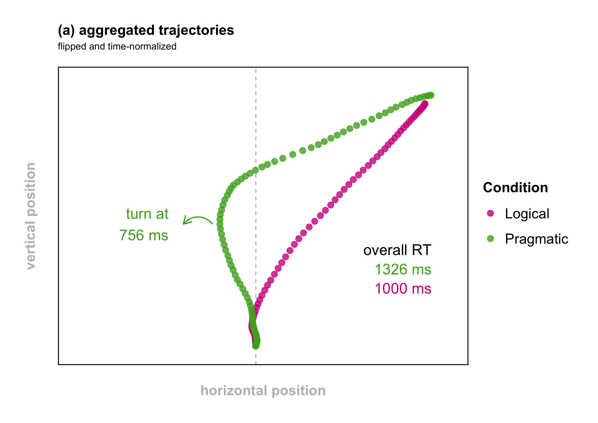
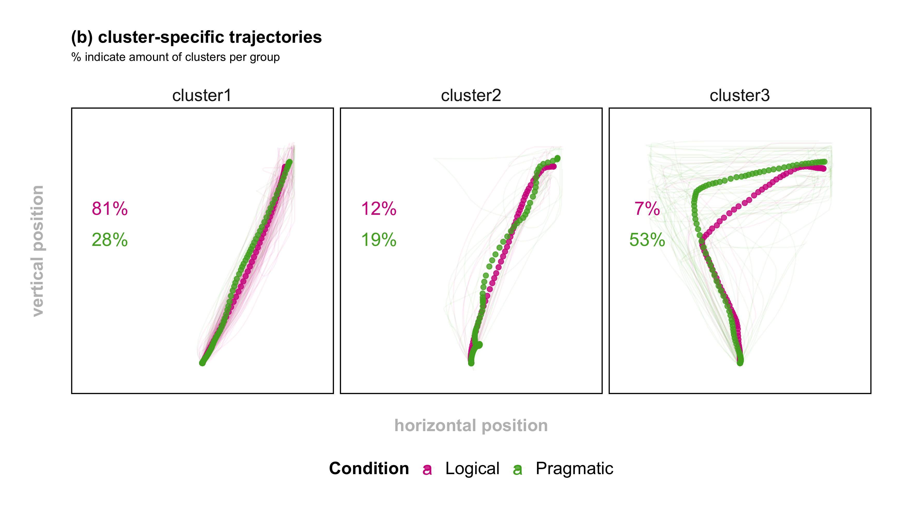
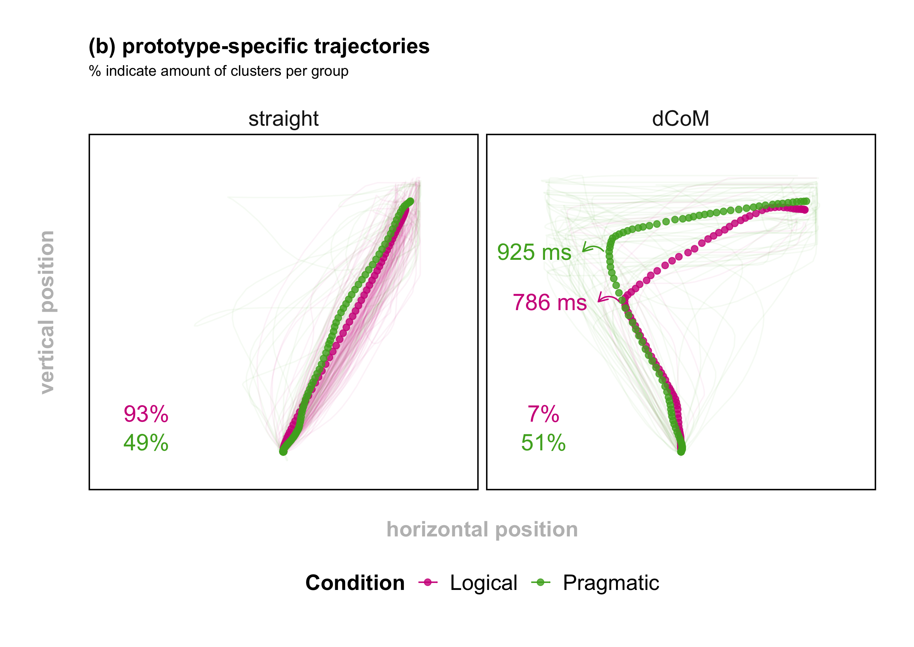

```{r setup, include=FALSE}
knitr::opts_chunk$set(echo = TRUE)

library(brms)
library(tidyverse)
library(kableExtra)
library(png)

```

## Pilot analysis

Here my first analysis attempt. Since Tomlinson was never interested in anything but the critical-some condition, I will only focus on that sentence-type. That breaks down the problem and makes the visual assesment and stats wield-able (making words up as I go). 

Okay, first, can we reproduce the AUC effect in the pilot data? Yes we can. Let's plot the aggregated trajectories for Logical vs. Pragmatic training.

```{r agg_plot, echo=FALSE, out.width = "100%"}




```

We can see that, in the logical condition, people move to the target in a direct straight line. In the pragmatic condition, they (on average) move into competitor space and then turn later towards the target. So all very much in line with Tomlinson and his two-step model.

I modelled the data as follows: scaled AUC predicted by centered Condition. Random effects... well not much complexity here (yay!). Its between-subjects, so only random intercept for subjects. Stimuli are also kinda useless atm, with more data we can estimate by-stimuli random slopes for condition, but for now we fair better with just random intercepts. That's cool, as the models are quickly estimated. (see priors below)

If we run a model on these data analog to Tomlinson, we get the following fit:

```{r 1st model results, echo=FALSE, warning=FALSE, message=FALSE, out.width = "100%"}
# 
# ## model AUC to reproduce Spivey et al. (2005) results
# # define weakly informative priors
# priors_xmdl <- c(
#   set_prior("normal(0,1)", class = "b"),
#   set_prior("normal(0,1)", class = "Intercept"),
#   set_prior("lkj(2)", class = "cor"),
#   set_prior("student-t(3,0,1)", class = "sd")
# )
# 
# # model AUC (ignoring clusters)
# xmdl_AUC <- brm(AUC_c ~ 1 + Condition_c
#                 + (1  | subject_nr)
#                 + (1 | stimulus),
#                 family = "gaussian",
#                 data = df_red, save_all_pars = TRUE,
#                 chains = 4, cores = 4,
#                 iter = 4000, warmup = 2000,
#                 control = list(adapt_delta = 0.9999, max_treedepth = 12),
#                 seed = 999
# )

load(file = "../models/AUC_models.RData")

pp_check(xmdl_AUC)

```

Looking at the posterior predictive check, there is a bump on the right that throws of the estimation quite a bit. What could that bump be??? It's of course categorically different movement trajectory types. (Mathias: we want the light blue lines to be similar to the dark blue line. If there is a strong divergence, the model doesn't accurately model the data)

Okay, I estimated the optimal number of trajectory types using four commonly used k-selection methods. Cluster stability (stability), and the slope statistic (slope) are the only useful ones for our purposes. The former estimates 2 clusters, the latter estimates 3. So let's check the data with clusters 2 and 3:


```{r cluster2, echo=FALSE, out.width = "100%"}


```

Okay so one trajectory type is kinda going straight to the target the other, on average, first moves to the competitor. That's pretty solid already. Let's check out three clusters.


```{r cluster3, echo=FALSE, out.width = "100%"}



```

I don't think that buys us anything. Cluster 1 is split into cluster 1 and 2 now with a few striaght-line ish trajectories.

What about just simply defining prototypes for the most extreme possible reactions: a *straight* line directly to the target and a *dCoM*, i.e straight line to the competitor and then correction to the target.

```{r prototypes, echo=FALSE, message=FALSE, warning=FALSE, out.width = "100%"}

prototypes <- data.frame(xpos = c(0,0,1200,0,-1200,1200), 
                         ypos = c(0,0,1300,0,1300,1300),
                         Condition = c("straight", "straight", "straight",
                                       "dCoM", "dCoM", "dCoM"))
prototypes

ggplot(prototypes) +
  #geom_path(data = df_red, aes(-xpos, ypos, color = Condition, group = mt_id), size = 0.5, alpha = 0.05) +
  geom_path(data = prototypes, aes(xpos, ypos, group = Condition), size = 3, color = "black") +
  geom_rect(xmin = -1.4, xmax = -0.8, ymin = 1.25, ymax = 1.85,
            color = "grey", fill = NA, alpha = 0.5, lty = "dashed") +
  geom_rect(xmin = 1.4, xmax = 0.8, ymin = 1.25, ymax = 1.85,
            color = "grey", fill = NA, alpha = 0.5) +
 # geom_point(aes(-xpos, ypos, color = Condition), size = 2, alpha = 0.8) +
  scale_y_continuous(expand = c(0, 0), limits = c(-200, 1650)) +
  scale_x_continuous(expand = c(0, 0), limits = c(-1850, 1850)) +
  labs(title = "(b) prototypes",
       subtitle = "\n",
       x = "\nhorizontal position",
       y = "vertical position\n"
  ) +
  facet_grid(~ Condition) +
  theme_classic() +
  theme(legend.position = "bottom",
        legend.key.height = unit(2,"line"),
        legend.text = element_text(size = 16),
        legend.title = element_text(size = 16, face = "bold"),
        legend.background = element_rect(fill = "transparent"),
        strip.text = element_text(size = 16),
        strip.background = element_blank(),
        axis.line = element_blank(),
        axis.ticks = element_blank(),
        axis.text = element_blank(),
        axis.title = element_text(size = 16, face = "bold", color = "grey"),
        plot.title = element_text(size = 16, face = "bold"),
        panel.border = element_rect(colour = "black", fill = NA, size = 1),
        plot.margin = unit(c(1,1,1,1),"cm"))

```

```{r prototype, echo=FALSE, out.width = "100%"}



```

Another thing that becomes very clear is that these dCoMs (cluster 2) are much more frequent for the pragmatic listeners, ultimately creating an asymmetry in AUC. Running a multinomial model predicting cluster by condition (using the four cluster solution) starts to capture these differences, but more juice is obviously needed. Here the numbers.

```{r clusterResults, echo=FALSE, message=FALSE, warning=FALSE, out.width = "100%"}


# # define weakly informative priors
# priors_xmdl <- c(
#   set_prior("normal(0,1)", class = "b"),
#   set_prior("normal(0,1)", class = "Intercept"),
#   set_prior("lkj(2)", class = "cor"),
#   set_prior("student-t(3,0,1)", class = "sd")
# )
# 
# # check how clusters are distributed across subjects
# xtabs(~cluster + subject_nr, df_red)
# # many empty cells, so no slopes
# 
# # model clusters
# xmdl_clusters <- brm(cluster3 ~ 1 + Condition_c
#                      + (1  | subject_nr)
#                      + (1 | stimulus),
#                 family = "categorical",
#                 data = df_red, save_all_pars = TRUE,
#                 chains = 4, cores = 4,
#                 iter = 4000, warmup = 2000,
#                 control = list(adapt_delta = 0.9999, max_treedepth = 12),
#                 seed = 999
# )

posteriors_output_cluster <- read_csv("../derived_data/posteriors_output_cluster.csv")
kable(posteriors_output_cluster[,2:7])
#print(xtable(posteriors_output_cluster), type="latex", comment=FALSE)

```

Bottom-line, we should take these clusters into account when estimating AUC values. That's what I did below and the posterior predictive check is much better. It's still not great and I think this is simply due to the priors being too lenient for the small amount of data.

```{r AUCxCluster, echo=FALSE, out.width = "100%"}

# ## model AUC as a function of cluster x condition
# # define weakly informative priors
# priors_xmdl <- c(
#   set_prior("normal(0,1)", class = "b"),
#   set_prior("normal(0,1)", class = "Intercept"),
#   set_prior("lkj(2)", class = "cor"),
#   set_prior("student-t(3,0,1)", class = "sd")
# )
# 
# 
# # model AUC x clusters
# xmdl_AUC_cluster <- brm(AUC_c ~ 1 + Condition_c * cluster4
#                 + (1 | subject_nr)
#                 + (1 + Condition_c | stimulus),
#                 family = "gaussian",
#                 data = df_red, save_all_pars = TRUE,
#                 chains = 4, cores = 4,
#                 iter = 4000, warmup = 2000,
#                 control = list(adapt_delta = 0.9999, max_treedepth = 12),
#                 seed = 999
# )

load(file = "../models/AUC_clusters_models.RData")

pp_check(xmdl_AUC_cluster)

```

If we look at the results and compare them to the first model (which ignores clusters), we can see that the impact of the training condition within cluster is clearly smaller. The first model estimated the effect of training to be around 1 standard deviation (Mathias: This is a very large effect). The model with clusters estimates the effects within cluster much smaller of course, but still noticable and all going into the same direction. In (b) you see the estimated deltas (logical AUC - pragmatic AUC).


```{r uberResults, echo=FALSE, out.width = "100%"}

knitr::include_graphics("../plots/uber_estimates.png")

```

The effect magnitudes range from -0.14 to 0.486 SDs which is still quite solid. Here you see the estimated deltas (logical AUC - pragmatic AUC).

```{r, echo=FALSE, message=FALSE, warning=FALSE}

posteriors_output_condclusters <- read_csv("../derived_data/posteriors_output_condclusters.csv")
kable(posteriors_output_condclusters[,2:7])

```

So what do we do? What do we need for a succesful replication? 

We could first define a ROPE of 0.1 SDs and just sample until we have reached the CI width of 0.1 and then evaluate the overlap between the posterior and the ROPE. This is achieved quickly, as the effect is massive. But its only massive because its an artifact. 

Second step could be a multinomial model, showing that trajectory types are indeed confounding conditions. 

A third step could be the cluster-dependent effect which is theoretically not predicted right? So do we care about showing that the AUC effect is (in)dependent of clusters?

If we do, do we care for all trajectory types, or only for some? What do we do with these cluster4 fuck-ups? Exclude them? Keep them in?

Questions over questions... that need to be answere in the prereg...
